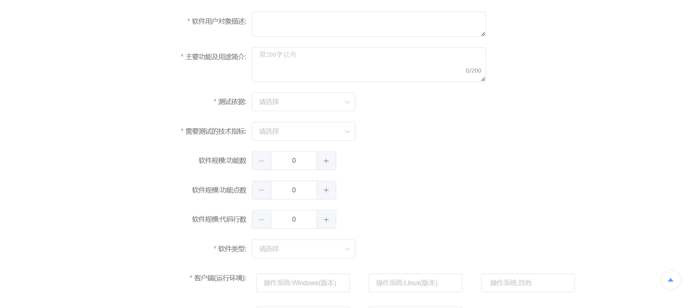

# 用户操作手册

  * [引言](#引言)
    + [1.1 编写目的]
    + [1.2 项目背景]
    + [1.3 定义]
    + [1.4 参考资料]
  * [软件概述](#软件概述)
    + [2.1 目标]
    + [2.2 功能]
  * [运行环境](#运行环境)
    + [3.1 硬件]
    + [3.2 支持软件]
  * [使用说明（客户部分）](#使用说明)
    + [4.1 用户注册]
    + [4.2 登录与账户管理]
      - [4.2.1 个人设置]
      - [4.2.2 修改个人信息]
    + [4.3 委托管理]
      - [4.3.1 发起委托]
      - [4.3.2 查看委托进展]
      - [4.3.3 委托修改]
    + [4.4 报价处理]
    + [4.5 合同处理]
    + [4.6 样品发送]
    + [4.7 测试报告查看]
    + [4.8 确认接受测试报告]
  * [使用说明（测试部分）](#使用说明)
   + [5.1 测试人员注册]
   + [5.2 测试人员登录]
   + [5.3 审核委托处理]
      - [5.3.1 审核委托处理（市场部部分）]
      - [5.3.2 审核委托处理（测试部部分）]
   + [5.4 发起报价（市场部处理）]
   + [5.5 生成合同草稿（市场部处理）]
   + [5.6 审核合同草稿（市场部处理） ]
   + [5.7 验收样品（测试部处理）]
   + [5.8 软件测试方案填写（测试部处理）]
   + [5.9 软件测试方案查看及审核（测试部处理）]
   + [5.10 测试文档填写（测试部处理）]
   + [5.11 测试报告填写（测试部处理）]
   + [ 5.12 测试报告审核（测试部主管处理、授权签字人处理）]
  * [运行说明](#运行说明)
    + [5.1 运行表]
    + [5.2 运行步骤]
      - [5.2.1 操作信息]
      - [5.2.2 输入输出文件]
      - [5.2.3 启动恢复过程]
  * [故障排除](#故障排除)
    + [6.1 常见问题解答]
    + [6.2 联系支持]
  * [维护和更新](#维护和更新)
    + [7.1 平台维护]
    + [7.2 更新内容]

## 引言

### 1.1 编写目的

本用户操作手册旨在为用户提供关于南京大学软件测试在线业务系统的详细操作指南，帮助用户更加快速地上手业务系统，了解系统的相关功能及操作，为客户的委托发起提供指导性作用，为测试人员提供操作指引；

### 1.2 项目背景

本项目基于南京大学软件测试中心的功能需求进行开发，旨在承接需要进行软件测试的客户委托，通过对软件测试中心给予的表格和文件信息，对整个委托流程进行生成，方便客户发起委托，进行上传和在线文档填写，对委托的承接进度进行实时跟进反馈，客户能够实时得到相关的委托进度和委托详情；并且直接串联客户和测试人员，测试人员能够收到客户的委托，查看委托的信息，得到相应样品，并给予客户相关的委托反馈；同时对委托的不同进度进行了分类，通过对测试人员职责的划分，其需要完成的文档填写也不尽相同；同时也方便了委托的电子文档及痕迹的保存，方便相关人员对流程及内容进行归档使用，查看历史记录内容。
操作手册将对不同权限的用户进行不同功能的操作指引，对应人员应查看对应的功能内容。
### 1.3 定义

本手册中涉及的专门术语和缩写词的定义如下：

- 委托：指客户发起的软件测试请求，有软件测试中心承接审核。
- 委托申请：指用户发起委托的申请，通过对软件测试中心规定的申请表填写，功能列表完善，样品资料发送，向软件测试中心进行申请。
- 测试方案：针对委托的具体测试过程和方法的计划文档。
- 测试报告：测试部门根据测试文档的相关，生成的测试成功总结和评估报告。
- 合同：用户和测试中心签订的委托执行协议。
- 保密协议：指客户在委托通过申请并查看合同后需要查看的相关条例，并要求其进行相关信息填写。

### 1.4 参考资料

- [软件测试流程](软件测试中心)
- [南京大学软件测试在线业务系统设计报告](作者)
- [南京大学软件测试在线业务系统需求文档](作者)

## 软件概述

### 2.1 目标

南京大学软件测试在线业务系统旨在为用户提供直观、方便、系统化的交互平台，规范工作步骤，提高软件测试工作的效率、完成质量以及工作体验。

### 2.2 功能

南京大学软件测试在线业务系统具有以下主要功能：

- 委托管理：用户可以发起委托、查看委托进展和结果。
- 测试方案管理：测试部门可以编写和上传针对委托的测试方案。
- 测试报告管理：测试部门可以生成并提交测试报告。
- 合同管理：市场部门可以生成和审核委托的合同。
- 用户管理：管理员可以管理用户账号和权限。

## 运行环境

 本在线业务系统采取前后端分离的开发模式，在线注册并登录使用。通过阿里云进行了网站部署，网址:http://121.41.61.66:9090/#/home；

## 使用说明(客户部分)

### 4.1 用户注册

客户可通过网页的窗口进行账号注册，信息不全会进行提示，按重置则对注册信息进行清空，按登录按钮则会跳转到登录界面，如果注册信息已被占用，则会提供相应报错。

### 4.2 登录与账户管理
- 打开浏览器，访问南京大学软件测试在线业务系统登录页面。
- 输入正确的用户名和密码登录。
- 客户可以在主页进行部分操作，例如发起多次委托、修改个人信息，并对相关的委托进行相应的进度查询和处理，例如发送样品、接收测试报告等，也可点击右上角的登出按钮进行退出；
GEILZE_QSJW_}H0@GKFTJ.png>)

#### 4.2.1 个人设置

- 初次登录要对个人信息进行完善，以方便后续发起委托；点击右边操作栏的个人信息完善功能，即可进入到信息完善界面；

在相应栏填写相关信息后，则可返回主页。

#### 4.2.2 修改个人信息
- 如果已经对用户信息进行完善，则可通过右上角的用户按钮进入到用户信息查看界面，之后的多次更改都可通过该界面（也可以通过个人信息完善进行操作）；唯一的区别就是通过该途径修改之后会跳出登录，需要重新登录。
$J~U.png>)

### 4.3 委托管理

#### 4.3.1 发起委托

- 登录后，点击“发起委托”按钮；

- 委托的提交内容分为三个步骤，包括申请表填写、功能列表填写、文档与签字上传；

- 点击面包屑即可跳转到相关进度表单；
- 点击登出按钮可以直接退出登录；
- 申请表中的大部分多选栏都可以通过输入生成选项；
- 申请表的表单拖动到下面之后可以点击右侧的置顶按钮，可以直接回到顶部；

- 功能列表中的功能项目栏可以自行添加删除(但是初始的功能项目0无法删除，且为必填项) 

- 文档与签字上传要求添加相应的文档和签字，文档限制为word(doc,docx)和pdf格式，签字限制为jpg和jpeg格式；
)FA5CBRLZ2-1.png>)

#### 4.3.2 查看委托进展
- 填完委托后可以在进度查询栏查看当前的委托进度，点击处理后可以进行操作，根据不同的进度会得到不同的操作内容；
 

#### 4.3.3 委托修改
- 如果委托被市场部驳回，则可以在进度查询下看到如下界面，此时可以通过点击修改委托按钮进行修改，并查看返回信息：
P6(`4I[4ZG{JLE`2@48J8.png>)
5%7DI.png)
- 此时的样品文档上传及签字上传则和申请表的修改放在了同一个界面中：

9L`)07~V71ND)$3YP.png>)
在进行修改后，进度又会恢复到原来的流程中，此时继续等待测试人员进行审核即可；

-如果委托被测试部驳回，大致流程会如同市场部，唯一的不同即为测试部驳回后返回的信息会不同：

#### 4.4 报价处理
- 如果你的委托内容成功通过了申请，就会接收到对委托的报价内容，同样是在相应的进度查询中查看，界面如下显示，你需要填写审核信息，选择审核意见，如果同意则上传相应的文件签字：

#### 4.5 合同处理
- 通过了报价之后，市场部会根据信息返回相应的合同草稿，依旧是在进度查询中得到相应的接口，点击进入；

- 进入之后会进入到合同草稿查看的界面，同报价处理一样，选择审核意见并上传文件签字；

- 然后进入到保密协议的填写，对相应的内容查看填写后进行提交。
QEZTLG}S5NZ)X14@[DNV.png>)

#### 4.6 样品发送
- 通过了合同之后，进度条来到发送样品的环节，点进进度查询，得到如下界面：
[8NN86J[1TD`ZDGNM.png>)
- 点击发送样品之后，进入到具体页面，你需要上传样品和样品信息，样品的格式被指定为zip或rar格式，样品信息则为word或pdf格式；

- 相关人员会对你的样品内容进行审核，并判断是否通过，不通过需要进行重新上传和相应处理；

#### 4.7 测试报告查看
- 在测试人员对内容进行审核和测试之后，会返回测试报告，此时仍然在进度查询中查看，点击查看测试报告即可：

- 以下是报告的相应界面：

- 完成测试报告的查看后，如果确认无误，则可以选择通过，一个完整的委托基本完成，只用等待授权签字人结束审核即可完成。

### 4.8 确认接受测试报告
- 您在流程结束后会得到如下界面，点击确认接收后流程即完成。

## 使用说明(测试人员部分)

### 5.1 测试人员注册

测试人员的账号则由指定的管理员账号进行登录后，注册生成（或者直接在后台完成信息注入后登录）；

### 5.2 测试人员登录
- 通过软件测试中心接口进入到测试人员登录界面，然后通过账号密码进行登录；
- 登录后根据账号类型的不同，有不同的功能栏界面；
- 市场部人员界面如下：

- 测试部人员界面如下：

- 质量部人员界面如下：
LH6RW1GW)(}1EGA5.png>)
- 测试部主管界面如下：

- 根据不同的任务职能，测试人员处理不同的任务进度。

### 5.3.1 审核委托处理（市场部部分）
- 市场部人员通过主页委托栏中的审核委托，通过点击处理进入到不同的委托审核中；

- 委托审核会先查看客户的信息内容，然后查看申请表（样品和签字内容可以通过该界面的下载按钮进行下载），继而查看功能列表，最后对审核信息进行填写，对委托进行处理。
5YEXJCOW9X.png>)

E830%A.png>)

### 5.3.2 审核委托处理（测试部部分）
- 测试部人员通过主页委托栏中的委托状态，通过点击处理进入到不同的委托审核中；

- 委托审核会先查看客户的信息内容，然后查看申请表（样品和签字内容可以通过该界面的下载按钮进行下载），继而查看功能列表，最后对审核信息进行填写，对委托进行处理(页面基本一致，在此不再一一展示，只展示最后不同的审核信息填写):
1DG4XIT]T_P4J9V8.png>)

### 5.4 发起报价（市场部处理）
- 在审核委托通过后，市场部可以对已经通过审核的申请发起报价：
9`I9ETZSWU~D(E$6($GV3.png>)
- 发起报价的页面如下：
U.png>)
HRRAD]992OEG.png>)
- 填写完报价后相应内容后，等待客户完成，再进入下一阶段；如果被驳回，则委托会回到生成报价这一步，你需要重新生成报价；

### 5.5 生成合同草稿（市场部处理）
- 在客户通过报价之后，市场部会收到相应的进度内容，其可以通过点击生成合同的按钮对其进行处理：
KDM4_{O])FM39.png>)
- 生成合同草稿的同时，保密协议的生成也会一并进行并传输;

### 5.6 审核合同草稿（市场部处理）
- 在用户填写完合同后，市场部会得到相应反馈，可以在主页的修改文件里的修改合同得到：

- 进入到合同审核之后，需要进行审核并给予反馈，如果拒绝，则市场部需要重新发起合同草稿及保密协议，供用户再次填写；

### 5.7 验收样品（测试部处理）
- 通过主页的委托状态中的验收样品，可以查看到需要验收的委托样品：
B@1V76CHPOS$S.png>)
- 如果样品验收不通过，则会重新返回到客户，重新进行验收反馈；

### 5.8 软件测试方案填写（测试部处理）
- 点击主页的编写测试方案，进入编写测试方案：

$T52ND.png>)
- 如果测试方案被驳回，则需要在对应栏内查找处理，对应质量部意见，修改之后重新提交测试方案，再进行审核，如此往复，直至成功；

### 5.9 软件测试方案查看及审核（测试部处理）
- 质量部登录后，即可看到需要审核的测试报告，测试报告查看，填写测试方案评审表；

### 5.10 测试文档填写（测试部处理）
- 测试方案同意后，则进入到测试文档填写的阶段，下图即为相应界面：

- 以下是测试文档的测试用例部分，增加按钮可以增加测试用例；

- 以下是测试文档的测试记录部分，逻辑同上：

### 5.11 测试报告填写（测试部处理）
- 测试文档填写完之后，保存到库中，进入到测试报告的填写，进入逻辑如下：
KY`QEU}Q0`N)IEO91.png>)
- 来到测试报告页面，需要填写信息栏，主体，测试环境，测试内容等部分：

_A2.png>)
G6@M_KUO7GYUHS(4.png>)
M.png>)
- 如果测试报告被驳回，则会重新进入填写流程，需要对其进行修改和完善；

### 5.12 测试报告审核（测试部主管处理、授权签字人处理）
- 二者的逻辑大致相同，因此不再一一赘述，以下只展示测试部主管的相应界面：
- 先来到主页，进入到相应的委托处理：

- 相应的测试报告界面查看如下：

- 查看完所有内容之后会要求填写审核信息，同意后则进入到下一阶段审核，驳回则由测试部重新填写后再次上交；

## 运行说明

### 6.1 运行表

- 以下是南京大学软件测试在线业务系统的运行表，列出了每种可能的运行情况及其目的。

| 运行情况 | 目的 |
| --- | --- |
| 登录系统 | 进入南京大学软件测试在线业务系统，进行操作和管理任务 |
| 发起委托申请 | 提交软件测试任务的委托申请 |
| 审核委托申请 | 对委托申请进行审核并提供审核结果 |
| 编写测试方案 | 根据委托的具体要求编写测试方案 |
| 提交测试报告 | 生成并提交测试报告给测试部门进行审核 |
| 查看测试报告审核结果 | 查看测试报告的审核结果和状态 |
| 生成合同草稿 | 根据委托要求生成合同草稿 |
| 查看合同审核结果 | 查看合同的审核结果和状态 |
| 查看委托进展 | 查看委托的当前状态和进展情况 |
| 查询用户信息 | 查询用户的相关信息和权限 |
| 输入操作信息 | 根据具体的操作需求和指导，输入相关的操作信息 |
| 完成运行 | 根据指导完成相应的运行操作，如提交委托申请、生成测试报告、审核合同等 |

### 6.2 运行步骤

-每种运行的步骤按照以下格式进行说明：

#### 5.2.1 操作信息

- 操作要求：根据具体的操作需求和指导，执行相应的操作要求。
- 启动方法：描述启动南京大学软件测试在线业务系统或相关功能的方法。
- 预计运行时间：估计完成该运行步骤所需的时间。

#### 5.2.2 输入输出文件

- 列出涉及的输入和输出文件的相关信息，如文件名称、编号、记录媒体、存留目录和文件的支配情况。

#### 5.2.3 启动恢复过程

- 描述在运行过程中可能需要进行的启动或恢复操作。
- 请根据具体的运行需求参考上述步骤进行操作。

## 故障排除

### 6.1 常见问题解答

- 登录遇到问题时，确保输入正确的用户名和密码。
- 提交操作遇到问题时，检查输入的信息是否符合要求。
- 系统错误提示时，尝试刷新页面或重新登录。

### 6.2 联系支持

- 如遇到无法解决的问题，请联系NJU南京大学软件测试在线业务系统的技术支持团队，提供详细的问题描述和相关信息，以便快速解决问题。

## 维护和更新

### 7.1 平台维护

- 定期进行系统维护和升级，以确保NJU南京大学软件测试在线业务系统的稳定性和安全性。

### 7.2 更新内容

- 随着NJU南京大学软件测试在线业务系统的发展和用户需求的变化，可能会推出新的功能和改进，用户可以及时了解更新内容，并根据需要进行升级。

