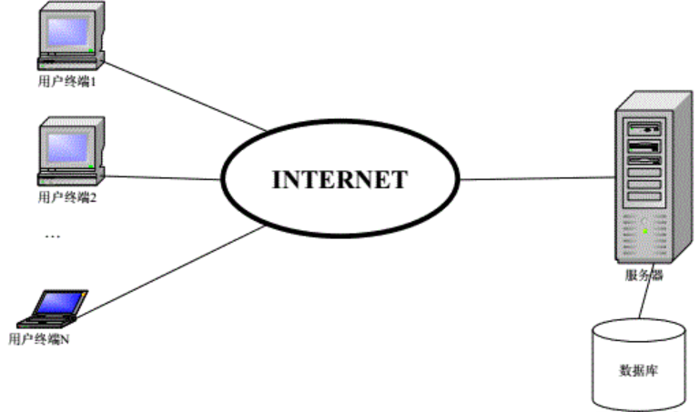
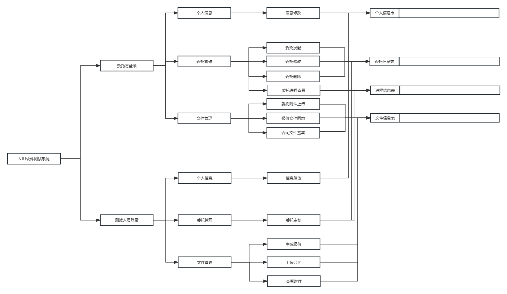
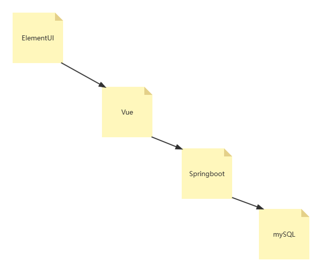

# E组-概要设计文档

## 1 引言

### 1.1 编写目的
&emsp;&emsp;为明确软件在线测试系统的系统结构、安排项目规划与进度、指定详细测试计划、组织软件开发与测试，特撰写本文档。 
&emsp;&emsp;本文档供项目经理、设计人员、开发人员参考。 

### 1.2 背景
开发软件名称：NJU软件在线测试系统 
任务项目提出者：南京大学软件测试中心 
项目开发者：软件工程实验E组 
用户：软件测试中心，软件测试委托方，系统管理员 
实现软件单位：软件工程实验E组 
项目与其他软件，系统的关系： 
本系统需要与软件测试中心用户管理系统相配合使用，所以在定义数据时要与已有系统相兼容。 
本系统采用B/S，服务器端采用及你太美为操作系统的工作站，是采用Microsoft SQL Server 2022以及Navicat Premium 16 的为开发软件的数据库服务程序。 

### 1.3 定义

SQL：结构化查询语言，关系数据库查询的标准语言 
SQL Server 2022: 微软公司生产的SQL Server数据库管理系统 
Navicat Premium 16: PremiumSoft生产的SQL Server数据库管理系统 

### 1.4 参考资料
《软件测试流程》 软件测试中心 
《需求分析文档》作者 
《设计报告》作者 
**……** 

## 2 任务概述

### 2.1目标
&emsp;&emsp;因大量用户需要使用本系统的前台，所以决定采用B/S体系来设计本系统。 
&emsp;&emsp;软件测试中心人员登录本系统后，系统列出多个可供使用的功能模块，包括：审核委托、生成报价、查看处理记录等等。委托方可以随时提交委托，查看委托的审核状态，以及根据系统要求补充材料和提交意见。 
&emsp;&emsp;本系统基于UML建模，概要设计应当输出用例图，主要用例的顺序图，系统的主要类图。 

### 2.2运行环境
硬件以及软件环境： 
&emsp;&emsp;1台服务器：不认识； 
&emsp;&emsp;客户机为普通支持浏览器的PC机； 
&emsp;&emsp;系统运行环境示意图如下： 
 

### 2.3需求概述
&emsp;&emsp;旨在开发一个网上软件测试委托平台，利用信息化手段辅助测试委托的管理和达成，便于客户和测试人员进行工作。客户可以方便地发起委托，上传文件，签订合同等；测试人员则可以方便地获取文件，审核软件，发起报价等。 
&emsp;&emsp;软件测试系统主要需求列表如下： 
&emsp;&rArr;注册管理功能。包括客户账号注册和查询以及测试人员账号注册和查询。 

&emsp;&rArr;委托管理功能。包括委托的发起、审核、取消等等。其中发起委托需要提交软件相关信息（软件名称、主要功能、软件大小、运行环境等）以及委托信息（测试项目、测试标准、期望完成时间等），审核委托需要提交审核结果和审核备注等等。 
&emsp;&rArr;用户信息管理。包括用户信息查询、修改、添加和删除。 
&emsp;&rArr;审核进程管理。包括审核进程查询、修改、添加和删除，以及测试人员对审核状态的添加与修改。 
&emsp;&rArr;文件信息管理。包括附件信息、报价文件信息、合同文件信息等的上传、查询、修改与删除。 

## 3 总体设计

### 3.1 基本设计概念和处理流程
&emsp;&emsp;针对委托方（客户）与测试人员两种用户角色，系统的处理流程如下： 
 

### 3.2 结构
 
&emsp;&emsp;本系统结构大致可以认为：前端页面由ElementUI做可视化处理，内核代码由Vue实现。前端产生请求后，根据所在页面产生请求，每个页面会对应后端的接口发送特定格式的JSONString，由后端接受后处理完毕返回对应的JSONString，前端接收后进行处理并且显示在用户界面上。
&emsp;&emsp;后端由Springboot框架实现，从对应的API接口获取JSON后，由Controller层传递到Server层进行解析和再打包，将对应的数据传至DAO层，通过Mybits注解发送至mySQL，获得回复后逐级返回，再Server层重新打包，交由Controller层传回前端。
&emsp;&emsp;Mybits通过DAO层内的注释控制，它并不受Mapper的控制。

### 3.3 功能分配
&emsp;&emsp;本系统中各功能需求与程序模块之间的关系如下表所示：
|功能需求|注册管理|用户管理|委托管理|审核进程管理|文件信息管理|
|---|---|---|---|---|---|
|注册账号|√|||||
|修改账号信息||√||||
|发起委托|||√|√||
|审核委托|||√|√||
|上传委托附件|||√|√|√|
|发起报价||||√|√|
|同意报价||||√|√|
|生成合同草稿||||√|√|
|签署合同||||√|√|
|审核合同||||√|√|
|上传样品||||√|√|
|审核样品||||√|√|
|生成测试方案||||√|√|
|审核测试方案||||√|√|
|生成测试报告||||√|√|
|审核测试报告||||√|√|

## 4 接口设计

### 4.1 用户接口
&emsp;&emsp;这个辐射他自己有问题

### 4.2 外部接口
&emsp;&emsp;我的手速没有问题，我的手速很快

### 4.3 内部接口
&emsp;&emsp;这个辐射有bug

## 5 运行设计
### 5.1 运行模块组合
&emsp;&emsp;这个辐射有必、优、寄

### 5.2 运行控制
&emsp;&emsp;这个地堡很寂寞，地堡的寂寞是土豆的错

### 5.3 运行时间
&emsp;&emsp;米国大兵蹲下站起蹲下站起

## 6 系统数据结构设计
&emsp;&emsp;2131232134

## 7 系统出错处理设计

### 7.1 出错信息

### 7.2 补救措施