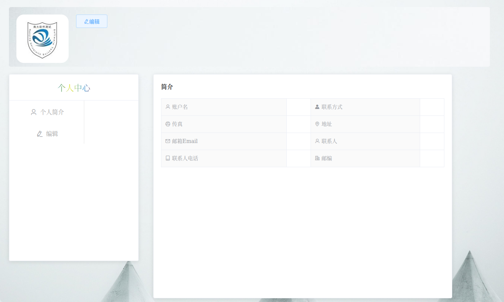
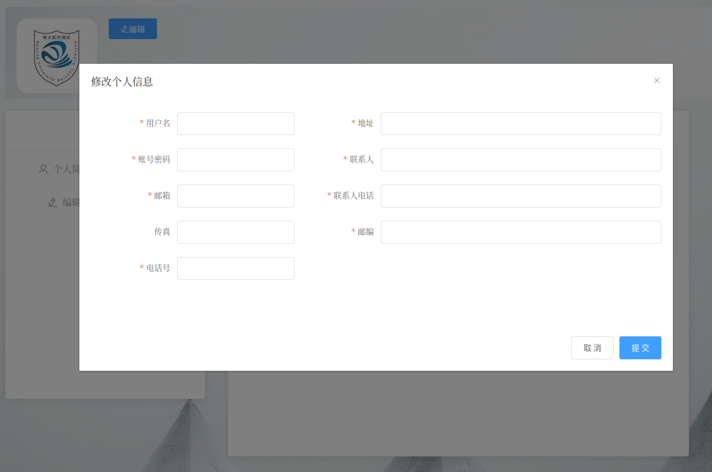

# 用户操作手册

  * [引言](#引言)
    + [1.1 编写目的]
    + [1.2 项目背景]
    + [1.3 定义]
    + [1.4 参考资料]
  * [软件概述](#软件概述)
    + [2.1 目标]
    + [2.2 功能]
  * [运行环境](#运行环境)
    + [3.1 硬件]
    + [3.2 支持软件]
  * [使用说明](#使用说明)
    + [4.1 安装和初始化]
    + [4.2 登录与账户管理]
    + [4.3 委托管理]
      - [4.3.1 发起委托]
      - [4.3.2 查看委托进展]
    + [4.4 测试方案管理]
      - [4.4.1 编写测试方案]
      - [4.4.2 查看测试方案审核结果]
    + [4.5 测试报告管理]
      - [4.5.1 生成测试报告]
      - [4.5.2 查看测试报告审核结果]
    + [4.6 合同管理]
      - [4.6.1 生成合同草稿]
      - [4.6.2 查看合同审核结果]
  * [运行说明](#运行说明)
    + [5.1 运行表]
    + [5.2 运行步骤]
      - [5.2.1 运行控制]
      - [5.2.2 操作信息]
      - [5.2.3 输入输出文件]
      - [5.2.4 启动恢复过程]
  * [故障排除](#故障排除)
    + [6.1 常见问题解答]
    + [6.2 联系支持]
  * [维护和更新](#维护和更新)
    + [7.1 平台维护]
    + [7.2 更新内容]

## 引言

### 1.1 编写目的

本用户操作手册旨在为用户提供关于NJU软件测试平台的详细操作指南，帮助用户正确使用平台，并了解平台的功能和特性。

### 1.2 项目背景

本操作手册是基于NJU软件测试平台的设计报告和需求文档编写的，旨在提供用户使用平台的指导和帮助。

### 1.3 定义

本手册中涉及的专门术语和缩写词的定义如下：

- 委托：用户提交给测试中心的软件测试任务。
- 委托申请：用户发起委托的申请，包括委托的具体要求和相关信息。
- 测试方案：针对委托的具体测试过程和方法的计划文档。
- 测试报告：测试部门根据测试结果生成的测试总结和评估报告。
- 合同：用户和测试中心签订的委托执行协议。

### 1.4 参考资料

- [软件测试流程](软件测试中心)
- [软件测试平台设计报告](作者)
- [软件测试平台需求文档](作者)

## 软件概述

### 2.1 目标

软件测试平台旨在为用户提供直观、方便、系统化的交互平台，规范工作步骤，提高软件测试工作的效率、完成质量以及工作体验。

### 2.2 功能

软件测试平台具有以下主要功能：

- 委托管理：用户可以发起委托、查看委托进展和结果。
- 测试方案管理：测试部门可以编写和上传针对委托的测试方案。
- 测试报告管理：测试部门可以生成并提交测试报告。
- 合同管理：市场部门可以生成和审核委托的合同。
- 用户管理：管理员可以管理用户账号和权限。

## 运行环境

### 3.1 硬件

- 计算机型号：根据平台要求提供的最低配置。
- 主存容量：根据平台要求提供的最低配置。
- 外存储器、媒体、记录格式、设备型号及数量：根据平台要求提供的最低配置。
- 输入、输出设备：根据平台要求提供的最低配置。
- 数据传输设备及数据转换设备的型号及数量：根据平台要求提供的最低配置。

### 3.2 支持软件

- 操作系统名称及版本号：根据平台要求提供的支持软件信息。
- 语言编译系统或汇编系统的名称及版本号：根据平台要求提供的支持软件信息。
- 数据库管理系统的名称及版本号：根据平台要求提供的支持软件信息。
- 其他必要的支持软件：根据平台要求提供的支持软件信息。

## 使用说明

### 4.1 安装和初始化

- 根据提供的安装指南进行软件测试平台的安装。
- 执行初始化步骤，包括设置管理员账号和相关配置。

### 4.2 登录与账户管理

- 打开浏览器，访问NJU软件测试平台登录页面。
- 输入正确的用户名和密码登录。
- 根据账户类型的不同，可以执行相应的操作，如发起委托、审核委托、编写测试方案、提交测试报告等。

#### 4.2.1 个人设置

- 用户已经登录，点击首页右上角按钮，进入个人信息页面, 个人信息包含：修改用户名，修改密码和邮箱等。

### 4.3 委托管理

#### 4.3.1 发起委托

- 登录后，点击“发起委托”按钮。
- 填写委托申请表格，包括委托的具体要求和相关信息。
- 提交委托申请并等待市场部审核。

#### 4.3.2 查看委托进展

- 登录后，点击“委托管理”菜单。
- 查看委托列表，了解委托的当前状态和进展情况。

### 4.4 测试方案管理

#### 4.4.1 编写测试方案

- 根据委托的具体要求和测试部门的工作流程，编写测试方案。
- 上传测试方案并等待质量部门审核。

#### 4.4.2 查看测试方案审核结果

- 登录后，点击“测试方案管理”菜单。
- 查看测试方案列表，了解测试方案的审核结果和状态。

### 4.5 测试报告管理

#### 4.5.1 生成测试报告

- 根据测试部门的工作流程，执行测试工作并记录测试结果。
- 生成测试报告并填写相关信息。
- 提交测试报告并等待测试部门审核。

#### 4.5.2 查看测试报告审核结果

- 登录后，点击“测试报告管理”菜单。
- 查看测试报告列表，了解测试报告的审核结果和状态。

### 4.6 合同管理

#### 4.6.1 生成合同草稿

- 根据委托的具体要求和市场部门的工作流程，生成合同草稿。
- 提交合同草稿并等待用户确认。

#### 4.6.2 查看合同审核结果

- 登录后，点击“合同管理”菜单。
- 查看合同列表，了解合同的审核结果和状态。

## 运行说明

### 5.1 运行表

- 以下是软件测试平台的运行表，列出了每种可能的运行情况及其目的。

| 运行情况 | 目的 |
| --- | --- |
| 登录系统 | 进入软件测试平台，进行操作和管理任务 |
| 发起委托申请 | 提交软件测试任务的委托申请 |
| 审核委托申请 | 对委托申请进行审核并提供审核结果 |
| 编写测试方案 | 根据委托的具体要求编写测试方案 |
| 提交测试报告 | 生成并提交测试报告给测试部门进行审核 |
| 查看测试报告审核结果 | 查看测试报告的审核结果和状态 |
| 生成合同草稿 | 根据委托要求生成合同草稿 |
| 查看合同审核结果 | 查看合同的审核结果和状态 |
| 查看委托进展 | 查看委托的当前状态和进展情况 |
| 查询用户信息 | 查询用户的相关信息和权限 |
| 运行控制 | 根据具体的运行需求和指导，执行相应的运行控制步骤 |
| 输入操作信息 | 根据具体的操作需求和指导，输入相关的操作信息 |
| 完成运行 | 根据指导完成相应的运行操作，如提交委托申请、生成测试报告、审核合同等 |

### 5.2 运行步骤

-每种运行的步骤按照以下格式进行说明：

#### 5.2.1 运行控制

- 根据具体的运行需求和指导，执行相应的运行控制步骤。

#### 5.2.2 操作信息

- 操作要求：根据具体的操作需求和指导，执行相应的操作要求。
- 启动方法：描述启动软件测试平台或相关功能的方法。
- 预计运行时间：估计完成该运行步骤所需的时间。

#### 5.2.3 输入输出文件

- 列出涉及的输入和输出文件的相关信息，如文件名称、编号、记录媒体、存留目录和文件的支配情况。

#### 5.2.4 启动恢复过程

- 描述在运行过程中可能需要进行的启动或恢复操作。
- 请根据具体的运行需求参考上述步骤进行操作。

## 故障排除

### 6.1 常见问题解答

- 登录遇到问题时，确保输入正确的用户名和密码。
- 提交操作遇到问题时，检查输入的信息是否符合要求。
- 系统错误提示时，尝试刷新页面或重新登录。

### 6.2 联系支持

- 如遇到无法解决的问题，请联系NJU软件测试平台的技术支持团队，提供详细的问题描述和相关信息，以便快速解决问题。

## 维护和更新

### 7.1 平台维护

- 定期进行系统维护和升级，以确保NJU软件测试平台的稳定性和安全性。

### 7.2 更新内容

- 随着NJU软件测试平台的发展和用户需求的变化，可能会推出新的功能和改进，用户可以及时了解更新内容，并根据需要进行升级。

