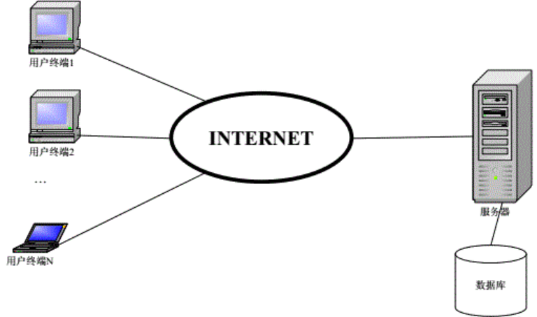
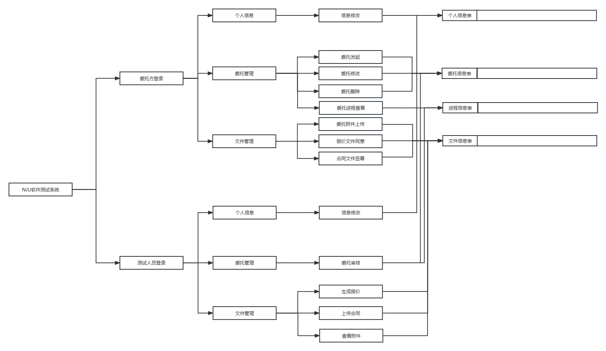
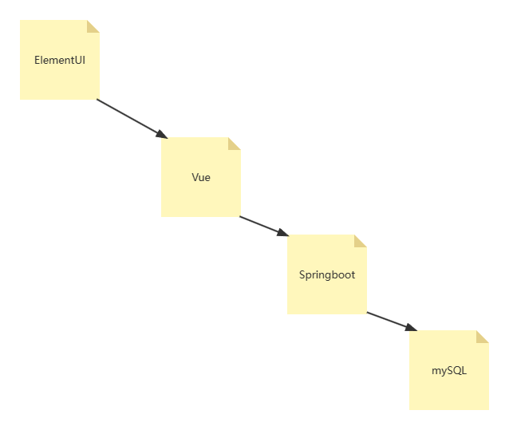

[TOC]

#  引言

## 编写目的
&emsp;&emsp;为明确软件在线测试系统的系统结构、安排项目规划与进度、指定详细测试计划、组织软件开发与测试，特撰写本文档，本文档供项目经理、设计人员、开发人员参考。

&emsp;&emsp;开发软件名称：NJU软件在线测试系统。
&emsp;&emsp;任务项目提出者：南京大学软件测试中心。
&emsp;&emsp;项目开发者：软件工程实验E组。
&emsp;&emsp;用户：软件测试中心，软件测试委托方，系统管理员。
&emsp;&emsp;实现软件单位：软件工程实验E组。
&emsp;&emsp;项目与其他软件，系统的关系：
&emsp;&emsp;本系统需要与软件测试中心用户管理系统相配合使用，所以在定义数据时要与已有系统相兼容。
&emsp;&emsp;本系统采用B/S，服务器端采用为操作系统的工作站，是采用Microsoft SQL Server 2022以及Navicat Premium 16 的为开发软		件的数据库服务程序。

## 定义

&emsp;&emsp;SQL：结构化查询语言，关系数据库查询的标准语言
&emsp;&emsp;SQL Server 2022: 微软公司生产的SQL Server数据库管理系统
&emsp;&emsp;Navicat Premium 16: PremiumSoft生产的SQL Server数据库管理系统

&emsp;&emsp;《软件测试流程》 软件测试中心

# 任务概述

## 目标
&emsp;&emsp;因大量用户需要使用本系统的前台，所以决定采用B/S体系来设计本系统。
&emsp;&emsp;软件测试中心人员登录本系统后，系统列出多个可供使用的功能模块，包括：审核委托、生成报价、查看处理记录等等。委托方可以随时提交委托，查看委托的审核状态，以及根据系统要求补充材料和提交意见。
&emsp;&emsp;本系统基于UML建模，概要设计应当输出用例图，主要用例的顺序图，系统的主要类图。

## 运行环境
硬件以及软件环境：
&emsp;&emsp;1台服务器：
&emsp;&emsp;客户机为普通支持浏览器的PC机；
&emsp;&emsp;系统运行环境示意图如下：

## 需求概述
&emsp;&emsp;旨在开发一个网上软件测试委托平台，利用信息化手段辅助测试委托的管理和达成，便于客户和测试人员进行工作。客户可以方便地发起委托，上传文件，签订合同等；测试人员则可以方便地获取文件，审核软件，发起报价等。
软件测试系统主要需求列表如下：
注册管理功能。包括客户账号注册和查询以及测试人员账号注册和查询。

&emsp;&emsp;委托管理功能。包括委托的发起、审核、取消等等。其中发起委托需要提交软件相关信息（软件名称、主要功能、软件大小、运行环境等）以及委托信息（测试项目、测试标准、期望完成时间等），审核委托需要提交审核结果和审核备注等等。
&emsp;&emsp;用户信息管理。包括用户信息查询、修改、添加和删除。
&emsp;&emsp;审核进程管理。包括审核进程查询、修改、添加和删除，以及测试人员对审核状态的添加与修改。
&emsp;&emsp;文件信息管理。包括附件信息、报价文件信息、合同文件信息等的上传、查询、修改与删除。

# 总体设计

## 基本设计概念和处理流程
&emsp;&emsp;针对委托方（客户）与测试人员两种用户角色，系统的处理流程如下：

## 结构

&emsp;&emsp;本系统结构大致可以认为：前端页面由ElementUI做可视化处理，内核代码由Vue实现。前端产生请求后，根据所在页面产生请求，每个页面会对应后端的接口发送特定格式的JSONString，由后端接受后处理完毕返回对应的JSONString，前端接收后进行处理并且显示在用户界面上。
&emsp;&emsp;后端由Springboot框架实现，从对应的API接口获取JSON后，由Controller层传递到Server层进行解析和再打包，将对应的数据传至DAO层，通过Mybatis注解发送至mySQL，获得回复后逐级返回，再Server层重新打包，交由Controller层传回前端。
&emsp;&emsp;Mybatis通过DAO层内的注释控制，它并不受Mapper的控制。

## 功能分配
本系统中各功能需求与程序模块之间的关系如下表所示：
|功能需求|注册管理|用户管理|委托管理|审核进程管理|文件信息管理|
|---|---|---|---|---|---|
|注册账号|√|||||
|修改账号信息||√||||
|发起委托|||√|√||
|审核委托|||√|√||
|上传委托附件|||√|√|√|
|发起报价||||√|√|
|同意报价||||√|√|
|生成合同草稿||||√|√|
|签署合同||||√|√|
|审核合同||||√|√|
|上传样品||||√|√|
|审核样品||||√|√|
|生成测试方案||||√|√|
|审核测试方案||||√|√|
|生成测试报告||||√|√|
|审核测试报告||||√|√|

# 接口设计

&emsp;&emsp;内部接口主要关注软件内部各个组件之间的通信和交互，具有较高的灵活性和可修改性，是实现软件内部模块化和分层的基础。外部接口主要关注软件系统与外部实体之间的交互，具有较高的稳定性和兼容性，是实现与外部系统集成的关键，软件开发中，内部接口和外部接口的设计和定义需要根据不同的需求和使用场景进行合理规划和划分。

## 外部接口

&emsp;&emsp;外部接口是软件系统与外部实体（如其他系统、用户、硬件设备或第三方服务）之间的交互界面，它定义了软件系统对外提供的服务、数据格式、通信协议、API（应用程序接口）等，外部接口主要用于与外部实体进行数据传输、功能调用或事件响应等，外部接口通常是确定的，并且具有稳定性和兼容性的要求，在软件开发中，外部接口的设计和规范十分重要，因为它们影响着与外部系统的集成和互操作性。

&emsp;&emsp;*详细接口文档见用户手册。*

## 内部接口

&emsp;&emsp;内部接口是指软件系统内部各个组件、模块或子系统之间的通信和交互方式，它们定义了内部组件之间的数据传输格式、方法调用规范、消息传递协议等，内部接口主要用于实现软件内部的模块化和分层，并使得各个部分能够相互协作、独立开发和测试，内部接口通常在程序代码中定义，并且可以进行修改、重构和优化，以满足软件内部的需求和设计要求。

&emsp;&emsp;*详细接口文档见 [md](md) 文件夹。*

# 运行设计

&emsp;&emsp;在本平台的程序中，通过多种数据结构和功能模块的组合，来实现一些相对复杂的功能。通过模块化设计将程序划分为多个独立的模块，每个模块负责实现一个具体的功能或一组相关的功能，让这些模块可以独立开发、测试和维护，使得程序具有更好的可读性、可维护性和可扩展性。

## 运行模块组合
&emsp;&emsp;运行模块之间的组合，是实现平台各项功能的基础，而这些模块之间的配合，往往体现在前后端的交互中，前端通过对后端给出的接口进行调用，实现复杂的功能，因此前后端的交互就是运行模块的交互，是各项功能实现的方法，而前后端各自的逻辑功能则是模块的实现方式。

&emsp;&emsp;增：例如创建账户，发起委托，都是由操作用户向网页提交内容，然后由网页根据这些内容将数据传回后端，由后端的程序将其存入数据库中，以备后续使用。

&emsp;&emsp;删：删除功能是前后端相对简单的交互模式，主要是由前端接收到用户发起的某些删除数据的请求，然后将该任务发送给后端，然后由后端根据收到的信息，在数据库中将对应的相关信息删除掉。

&emsp;&emsp;查：查找是数据库最基础的功能之一，而数据库中最常用的查询功能便是根据一个或多个关键字（键）去对其内容进行查询，在数据库中定位到所需的信息，是对已有数据进行操作的基础。

&emsp;&emsp;改：修改是非常常用的操作，尤其在本项目中，平台作为委托流程的中间维护者，需要实时地推进当前委托的进度，因此必须经常修改数据库中的内容，从而使得委托的进度状态能以信息的形式实时地存储在数据库当中。

## 运行时间
&emsp;&emsp;本平台的网站运行相对流畅，我们组选择为网站配置了阿里云服务器，在初次使用时，可能会存在卡顿的情况，但是之后使用时速度会明显提升，在各功能间的跳转非常稳定，每项功能在使用时运行流畅，不会发生意外的卡死、延迟等情况，在使用时，也完全可以满足正常用户的使用需求。

# 系统数据结构设计
&emsp;&emsp;本平台的内部数据采用sql数据库进行管理，使用mybatis对其进行操作和功能的编写，同时在维护时采用了Heidisql的可视化数据库工具，通过多表联存、联查、联用的方式，即可实现对数据存储和调用的需求。
