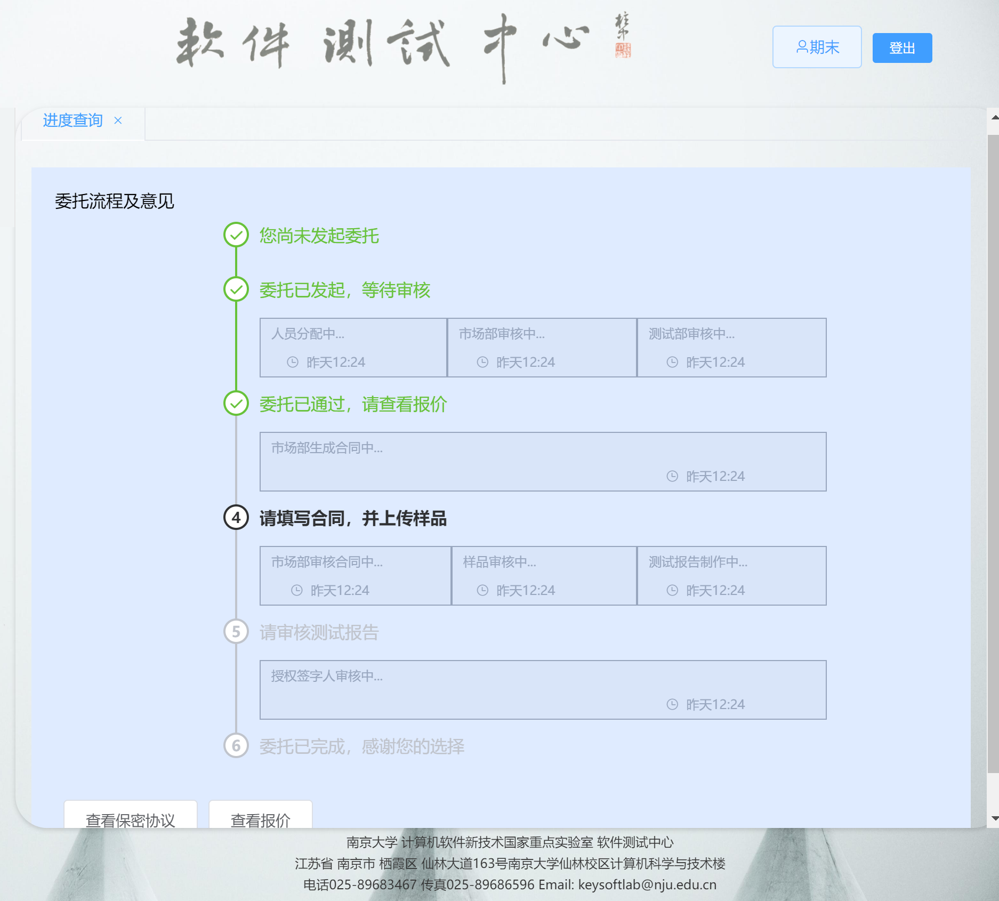
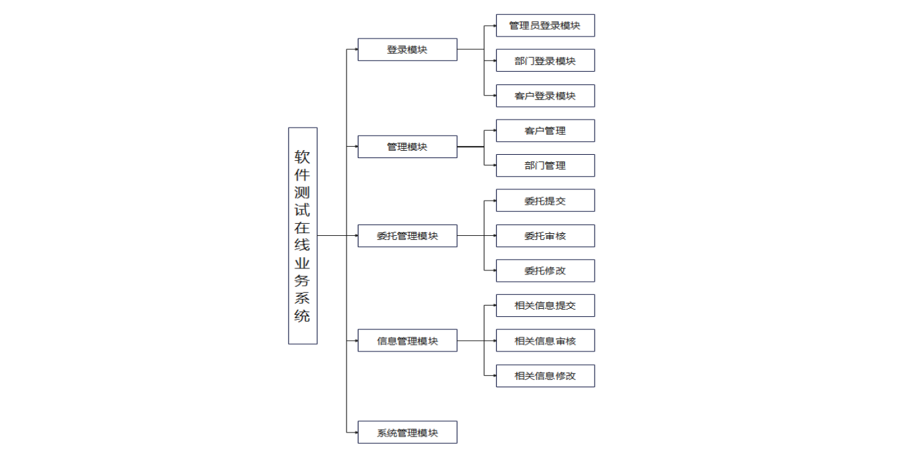
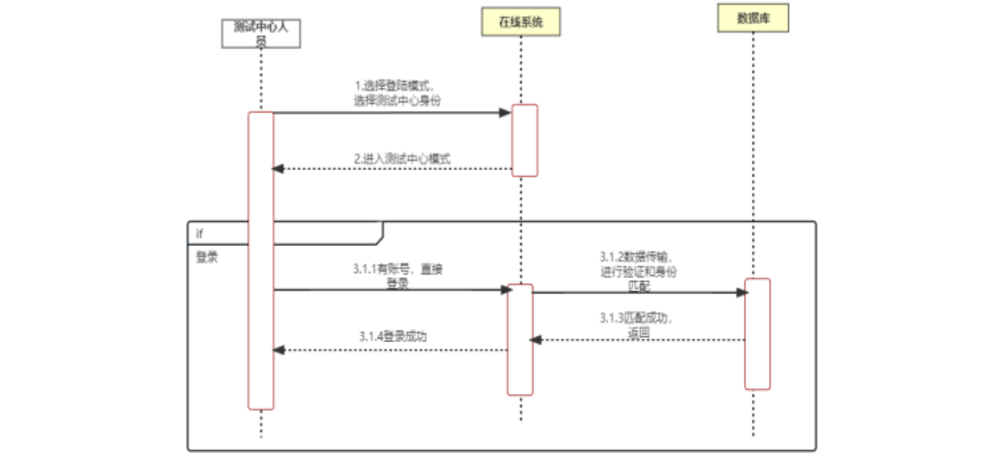
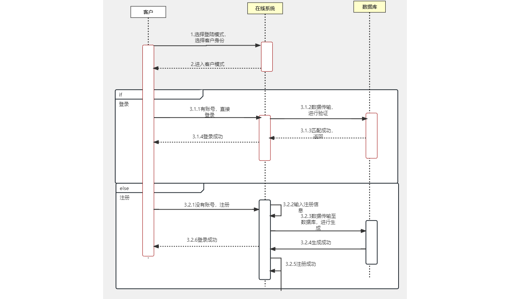
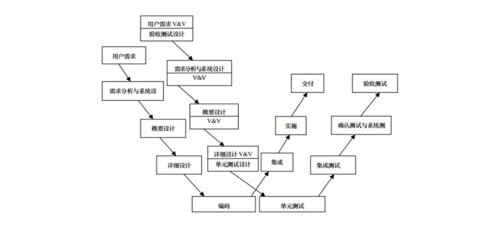
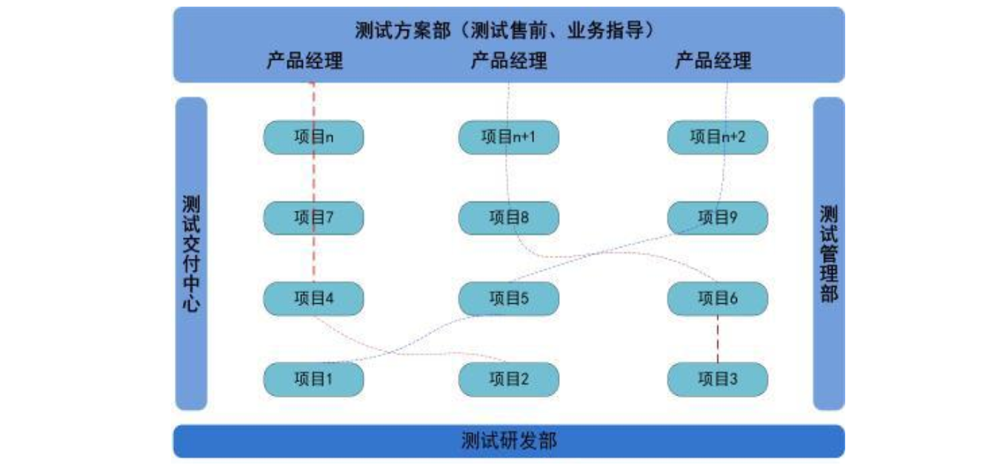
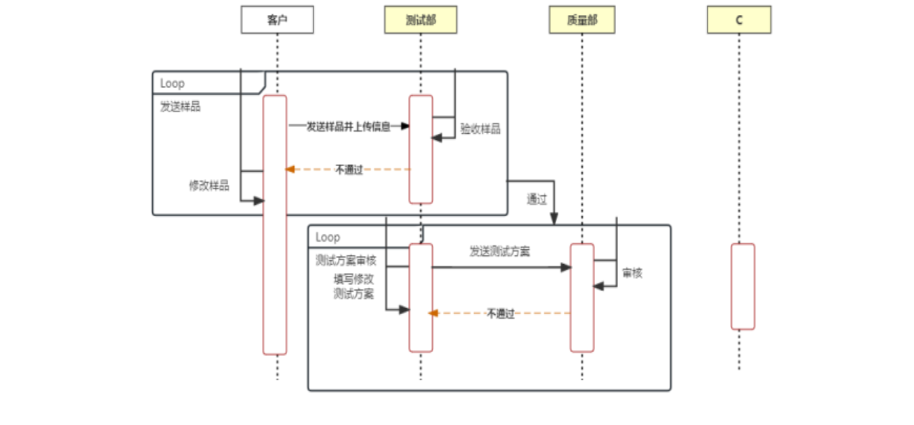
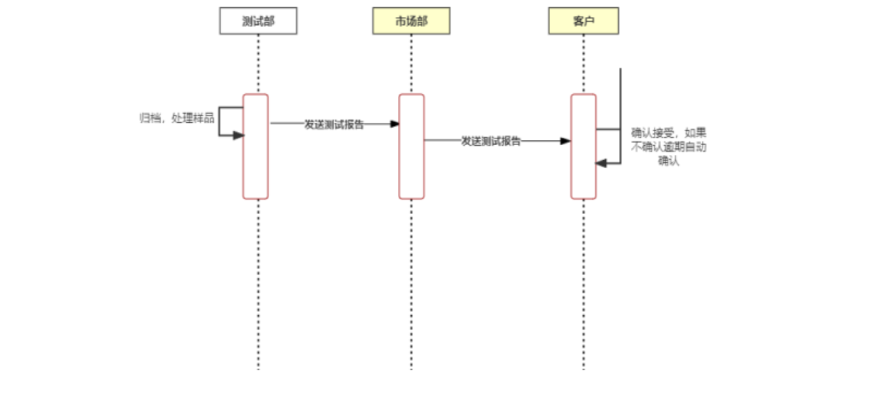
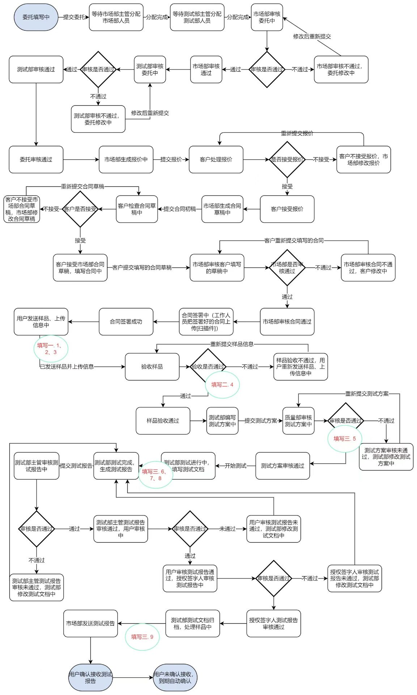
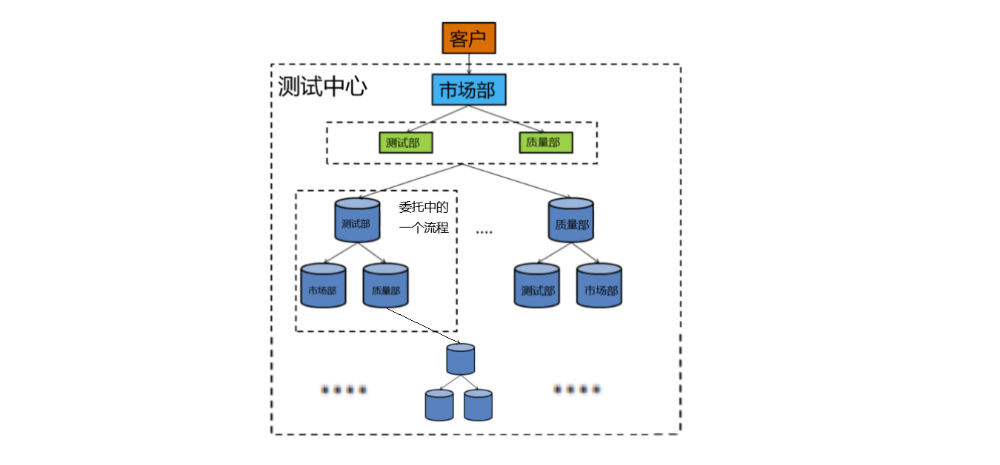

[TOC]

# 引言

软件测试是基于技术手段验证软件是否满足需求，存在相应的漏洞，从而达到减少代码缺陷，保障软件质量的作用，而本项目旨在为使用者提供一个直观、方便、系统化的交互平台，从而规范其工作步骤，提高软件测试工作的效率、完成质量以及工作体验。

# 项目简介

软件测试平台即为客户打造了集高效率、低成本等特性于一身，大幅缩短了软件产品测试周期，并且可以提升产品品质，同时还能充分发挥虚拟化的优势，减少物理工作站的数量，和降低客户的IT系统能耗、提高了空间使用效率的软件测试工作空间。

# 需求分析

## 账户

在注册时就确定账户的不同类型，每个账户有且仅有唯一一个不可变的类型，通过这一类型，即可确认该账号的权限和功能，可以浏览、操作哪些内容都是确定的，这些不同的权限和功能就对应着他们的部门（或客户）身份，通过这样的身份区分机制来区别账号登录后进入的界面，并进一步地限制其权限，提供其所需的服务。

### 管理员：

管理员作为使用本平台的软件测试服务提供者的代表，具有最高等级的浏览、操作等权限，可以为公司的其他部门分配账号，即某公司开始使用本平台时，首先只能注册若干个管理员账号，而下面的“市场部”、“测试部”、“质量部”的部门专用账号类型，则需要管理员账号的持有者手动进行注册，并将其分配给该公司中属于其他部门的员工。

在该公司收到任何软件测试的委托，并经由本平台进行交流时，账号类型为管理员的用户具有更高等级的浏览权限和操作权限，例如对委托具体细则的审核与备注，对相关部门工作报告文档的浏览，对相关部门报告内容的审核，对每个流程的审核内容进行批复等等功能，都是指面向特殊的管理员账号类型的，除此之外的其他任何用户都没有这么高的权限。

管理员并非单一的用户类型，管理员这种账号类型本质上只是为了明确本平台各用户的权限等级，而权限等级高的都属于管理员，但在这些管理员当中，有些是代表公司这个整体的管理员，例如该服务提供者注册的第一个“管理员”账号，有些是各部门的主管，这部分用户虽然不一定能获得对所有流程的读写权限，但是对于本部门的工作有着相对较高的权限，同时要承担该部门的总结、收尾工作，还有些“管理员”可能是对应项目的负责人，例如某次委托的情况比较特殊，因此需要一位负责人来统筹兼顾该委托的全部流程，从而绕过一些原定的稳定，但是可能存在一些冗余的流程，以达到提高这次委托的受理效率、并且提高委托完成的质量的目的，这部分账号类型对应的用户除此之外还可能有各公司的法人、签字人等具有代表性的用户。

### 客户：

该账号类型对应的用户便是本平台的使用者、发起委托的软件测试服务使用者，该用户类型是只与软件测试服务提供者产生了业务往来的、与该公司完全无关的平台使用者，即软件测试委托的发起者。

客户在这个流程中并不会具备太高的权限，因为客户这段时间也没有必要知道如此详细清楚的后台信息，与其他归属于公司的用户账号相比，客户这一用户类型最大的特权是可以发起委托，并且可以随时查看自己正在进行的委托的进展如何，同时，客户永远是委托的发起者，是每一个委托第一个经手对象，因此用户填写委托的功能一定要清楚明了。

### 市场部：

市场部的工作主要集中在委托的前期，根据用户对本次委托提出的需求和实际情况、社会环境等因素，对用户的委托进行评估，并根据评估的结果与发起委托的客户进行对接交流，市场部要根据市场情况、用户要求、委托的难度和完成委托所需的资源等种种因素综合考量、在对委托进行评估以后，向用户给出报价、合同文书模板、委托内容确认等多种信息，并对用户提交的一部分相关内容进行处理。

因此市场部的主要权限是与用户对接、接收并浏览用户发起的委托的信息、生成报价即其他委托相关信息、与用户签订合同、审核合同的填写状况、在得到用户提交的委托相关信息后，与测试中心的其他工作部门进行交流，拟定关于这次委托的具体细则并上传，如果该委托能够顺利完成，也由市场部负责最后的提交，与用户进行确认性质的交互，并负责后续的解答，对用户关于这次委托相关内容提出的问题作出反馈。

### 测试部：

软件测试是软件开发过程的重要组成部分，也是本平台接受的主要业务内容，是用来确认一个程序的功能或性能是否符合开发之前所提出的一些要求。软件测试就是在软件投入运行前，对软件需求分析、设计规格说明和编码的最终复审，是软件质量保证的关键步骤，测试部要做的工作是保证软件正确地实现了一些特定功能的一系列活动，即保证软件以合格的标准做了你所期望的事情。

测试部是测试中心负责具体测试工作的部门，因此测试部在整个接受委托的流程中具有很高的参与度，具体功能有：浏览并审核收到的委托，并且确定是否接受该委托，在确认要接受某项委托后，测试部的账号类型可以浏览该委托的具体内容及详细要求，并可以根据委托的信息上传测试方案，测试方案在经由审核通过后，测试部对软件进行具体测试，并可以上传包含测试结果等反馈内容的文件或信息。

### 质量部：

质量部负责对委托的整体完成情况进行质量把关，为确保产品满足用户要求，以产品、工序或体系为目标，通过审核和监督判断所交货产品的质量，或者产品制造过程中工序的适应性，或者公司质量管理体系的有效性，以便及时暴露质量管理缺陷或问题，从而实施改进工作，增强公司质量管理能力以及提高产品质量。

主要的参与环节在委托流程的后期，即对测试中心本次接受委托后的工作质量进行审核，因此质量部具有很高的浏览权限，并且以工序审核为主，通过对工序质量控制的有效性进行审核，考核各工序或工序中影响工序质量的各种因素是否处于受控状态。主要审核方式是，基于常规的质量保证规定，或者用户申诉而临时安排，通过验证、抽查和考核测试过程中影响产品质量的各种因素的变动情况，以便采取对策并提交改进方案。质量部审核的主要作用在于：确保生产过程按规程、规范的流程和要求进行；随时监控质量动向，一旦质量出现不受控情况，必须立即找出异常原因，尽量把质量故障消除在发生之前；通过审核及时发现质量问题并及时纠正，杜绝重复发生。

## 目标

软件测试是基于技术手段验证软件是否满足需求，存在相应的漏洞，从而达到减少代码缺陷，保障软件质量的作用，而本项目旨在为使用者提供一个直观、方便、系统化的交互平台，从而规范其工作步骤，提高软件测试工作的效率、完成质量以及工作体验。

营造安全可靠的软件运行空间：安全在任何服务器实现中都是一项核心挑战，承载多台虚拟机的服务器(也称为合并服务器)不仅要承担与非合并服务器同样的安全风险，还要面对管理员角色分离的挑战，软件测试平台有助于提高合并服务器的安全性和解决管理员角色分离的挑战，通过下列功能来实现此目的：强大的分区能力、硬件级别安全性、系统服务虚拟化、网络安全功能和最小的受信任计算基础。

强大的隔离能力：服务器虚拟化使具有不同资源要求的工作负载能够在同一主机服务器上共存，软件测试平台通过灵活的内存分配、动态的硬件添加和灵活的网络配置，大幅提高主机服务器的物理资源的使用率。

性能大幅提升：软件测试平台采用基于64位管理程序的轻型、低开销虚拟化体系结构，通过过核心支持，可以为每个虚拟机分配多达8个逻辑处理器，同时支持64位主机和来宾操作系统,此外，通过服务器硬件技术打通从客户操作系统到真实硬件资源的通路，避免指令转换和数据转换的漫长过程，减少80%虚拟化应用导致的性能损失。

更简化的管理：在可能部署的数据中心和远程分支机构安装中，需要强大的管理功能和自动化功能来完全实现虚拟化降低成本的可能性。软件测试平台通过可扩展管理、用于虚拟机管理的界面以及脚本和组策略对象管理和自动化功能满足了此需求，同时对于硬件平台监控管理系统可以满足端到端的全程管理。

## 流程

首先由用户发起委托，填写委托申请完成之后，用户可以将委托通过网页上传提交给测试中心，测试中心收到该委托之后，首先由市场部主管受理该委托，此时委托流程需要等待市场部主管分配市场部人员，市场部人员分配完成之后，还需要等待测试部主管分配测试部人员，待市场部和测试部人员都分配完成后，市场部开始对该委托进行审核，若市场部审核不通过，则需要发起该委托的用户重新提交委托申请，再交由市场部重新审核，若市场部审核通过，则接下来交由刚分配的测试部人员对该委托进行测试部层面的审核，若测试部审核不通过，则同样需要对委托进行修改，并重新提交委托，待测试部的审核通过之后，再将该委托的处理权限交由市场部，然后由市场部根据该委托的具体要求、实现难度、工作内容、工作量等要素，来生成一个对该委托的初步报价，市场部提交该报价后，客户就可以看到这个报价信息，并根据自己对该委托的预期来对这个报价进行评估，如果用户不接受该报价，则可以将其回退给市场部，与市场部进行进一步的交流和协商，并由市场部修改此报价，然后通过网站重新提交给发起委托的客户，

在市场部与客户在报价的方面取得协商后，由市场部生成属于该委托的合同初版草稿，并将这份合同草稿提交到网站上，此时客户即可在网站上对其进行确认，如果客户在阅读该草稿后对合同有不接受的部分，则可以将其退回给市场部，与市场部交流协商后，由市场部重新修改合同草稿，客户在确认并同意该合同后，即可进行填写和签字，并将这份填好的合同草稿提交回市场部，待市场部审核用户的填写合格后，即可认为该合同正式生效，此时由测试中心的工作人员对签署好的合同扫描件进行上传，到这时该合同的内容正式确认并生效，委托的具体工作即可正式开始，首先由用户向测试中心发送软件的样品，并上传委托相关的具体信息，若样品验收不通过，则需要由客户重新上传样品，

当客户提交的样品代码成功验收之后，测试中心即可据此进行测试工作，基于技术手段验证委托中用户上传的代码是否满足相关的需求，是否存在相应的漏洞或代码缺陷等问题，在测试工作开始之前，首先由测试部对委托进行受理，并提交对于该委托专门设计的测试方案文档，此时由质量部对该测试方案进行审核，如果测试方案没有通过质量部的审核，则测试部需要重新编写测试方案文档，并且再次上传，待测试部的测试方案通过审核之后，测试部即可根据该方案开始对代码的测试工作，测试完成后生成测试报告并提交，此测试报告由测试部主管先进行审核，若审核不通过则需要测试部重新根据测试结果填写测试报告文档，若审核通过之后即可将该测试报告发送给发起委托的客户，并有客户验收测试结果，若测试结果未能符合客户验收的预期结果，则用户可将该报告退回测试部，由测试部根据测试结果，重新生成一个新的测试报告，待客户验收测试报告文档通过以后，即可将该委托的测试报告交由授权签字人审核，若授权签字人审核未通过，则需要测试部重新根据测试结果填写测试报告文档，

待授权签字人审核合格并对该委托签字之后，测试部将该测试文档归档，并根据用户事先通过合同给出的要求，对委托中客户上传的测试样品进行处理，然后由市场部将正式的测试报告发送给客户，用户可以对此进行确认，也可以在一段时间未确认后，自动认为委托完成，到期后自动确认收到。

# 功能设计

测试管理、计划管理、发布管理、文档管理、事务管理等等，能够把软件研发中的需求、任务、bug用例、计划等要素有序地跟踪管理起来，完整地覆盖了项目管理的核心流程，支持多个人共同开发同一个项目，实现共享资源，实现最终集中式的管理。可以把这个平台理解为一个公共库，里面存放各种文件，通过给每个文件打上标号，记录文件的每次存储，方便查找使用，帮助所有类型的团队管理他们的工作。

## 前端

### 账号注册

用户可以注册一个新的账号，注册过程简单、直观和用户友好，用户应能轻松填写必要的信息，并明确了解所需的步骤，用户可以通过账号的用户名和密码登录到本网站，网站可以对用户的密码等关键个人信息进行必要的加密保护，注册账号时要求用户提供有效的电子邮箱地址，这有助于用户与账号的对应，并且可以用于后续的通信和密码重置，在用户注册过程中，提供明确的错误提示和反馈信息，例如，当用户输入的信息无效或已经被使用时，显示相应的错误消息。

### 发起委托

用户可以发起测试项目的委托申请，确定对委托项目的预算，并选择适合的支付方式，如在线支付、支付宝、银行转账等并在各种审核通过后，选定一个或多个合适的服务提供者，通过平台上的消息系统，与他们进行沟通，进一步讨论和确认委托的细节对已经正式开始的委托进行进度追踪，可以实时掌握自己发起的委托的流程进行到了哪一步，有没有出现什么问题，可以与测试中心进行交流协调。

### 处理委托

对于正式进行中的委托，测试中心的各部门人员可以浏览当前需要自己去处理的委托流程，并提交相关的工作内容，可以与相关部门或人员进行对接交流，工作人员可以通过由测试中心的管理员注册自己的工作账号，获得员工的身份，从而可以处理委托，进行工作，同时由于员工账号的身份不同，他们获得的工作权限也会有所不同，从而网站对其呈现的界面和操作功能也会有所不同。

## 后端

### 数据库

可以存储用户信息，例如用户名和密码的对应关系，用户的个人信息和联系方式等内容，有助于各种流程进行时提高效率和安全性，还可以存储测试用例和测试数据，数据库用于存储测试用例和测试数据，包括测试步骤、输入数据、预期结果等，测试人员可以将测试用例和相关数据保存在数据库中，以便随时访问和管理，记录测试执行结果，测试人员执行测试用例时，将测试结果记录在数据库中，这包括测试通过、失败或出现异常的情况，数据库可以跟踪每次测试执行的详细信息，如执行时间、测试人员、运行环境等，存储数据分析和报告，使得测试人员能够对测试数据进行分析和生成各种测试报告，通过数据库中的数据，可以计算测试覆盖率、通过率、失败率等指标，并生成相应的图表和统计信息，可以实现团队协作和合作，在软件测试团队中促进协作和合作，不同的测试人员可以访问和共享同一个数据库，追踪测试状态、交流问题、共享测试数据等，方便数据备份和恢复，通过数据库提供的数据备份和恢复功能，可以保护测试数据不受意外事件或系统故障的影响，定期备份数据库可以避免数据丢失，并在需要时通过恢复操作将数据库恢复到先前的状态。

### 后端功能实现

后端通过提供接口提供与数据库交互和操作的各种功能和方法，使开发人员能够有效地管理和利用数据库中的数据，需要提供对连接、查询、更新、事务、权限控制、错误处理、数据类型和性能优化等方面的支持，从而简化开发人员与数据库之间的交互过程，首先是前后端的连接和断开连接，允许应用程序与数据库建立连接，并提供方法来断开连接，通过连接，应用程序可以与数据库建立通信并执行操作，提供了执行查询语句和更新语句的使用方法，使测试人员可以通过这些方法向数据库发送信息，并获得查询结果或更新数据库中的数据，允许开发人员执行数据库管理任务，如创建数据库、创建表、修改表结构、备份和恢复数据等，这些方法使开发人员能够管理数据库结构和配置，提供对数据库和表的访问控制功能，管理员账号可以定义和管理用户权限，限制对数据库和表的访问，以保护数据的安全性，实现合理的数据类型和转换，方便测试人员将数据转换为适当的数据类型，并对数据进行格式化和校验，以确保数据的正确性和一致性。