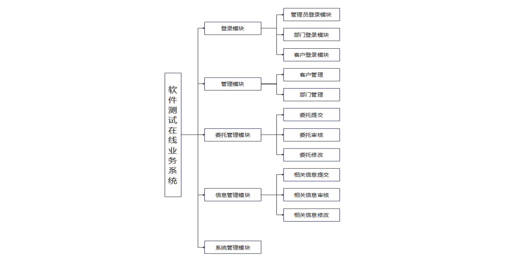
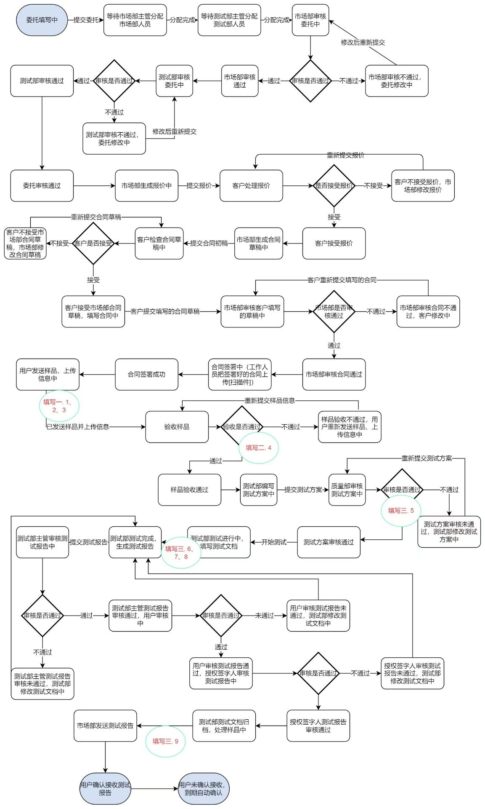

[TOC]

# 引言

## 定位与目标

​		软件测试客户与测试中心存在不便利，业务来往缺少直接媒介，使得业务承办进展速度慢，效率低；同时目标客户也缺少简洁有效的渠道进行委托交付。因此，基于软件测试中心的委托需求，制作完成软件测试在线业务系统，主要目标为承接客户委托，完成客户与中心之间的对接、中心不同部门（市场部、测试部、质量部）之间的交互，完成基础账号的注册登录，管理员及不同部门账号的权限分级，从而帮助业务流程顺利进行，继而完成交易的达成；同时也帮助业务的过程记录，使得业务管理更加透明清楚，方便测试中心对其进行管理和查询，促进业务开展。

## 软件需求分析理论

​		软件需求分析是研究用户需求得到的东西，完全理解用户对软件需求的完整功能，确认用户软件功能需求， 建立可确认的、可验证的一个基本依据。软件需求分析是一个项目的开端， 也是项目实施最重要的关键点。 据有关的机构分析结果表明， 设计的软件产品存在不完整性、 不正确性等问题 80％以上是需求分析错误所导致的，而且由于需求分析错误造成根本性的功能问题尤为突出。因此，一个项目的成功软件需求分析是关键的一步。

## 软件需求分析目标

​		对实现软件的功能做全面的描述，帮助用户判断实现功能的正确性、一致性和完整性，促使用户在软件设计启动之前周密地、全面地思考软件需求。了解和描述软件实现所需的全部信息，为软件设计、确认和验证提供一个基准。为软件管理人员进行软件成本计价和编制软件开发计划书提供依据。需求分析的具体内容可以归纳为六个方面： 软件的功能需求， 软件与硬件或其他外部系统接口，软件的非功能性需求， 软件的反向需求， 软件设计和实现上的限制，阅读支持信息。软件需求分析应尽量提供软件实现功能需求的全部信息， 使得软件设计人员和软件测试人员不再需要需求方的接触。 这就要求软件需求分析内容应正确、 完整、一致和可验证。此外，为保证软件设计质量，便于软件功能的休整和验证，软件需求表达无岔意性，具有可追踪性和可修改性。

# 需求背景

## 项目背景

​		将要开发的软件名为《软件测试在线业务系统》，本项目的提出者是南京大学计算机科学与技术系与软件测试中心，开发者为20级南京大学计算机科学与技术系本科生软件工程大实验E组成员 ，主要用户是在线测试中心与其目标客户，该软件主要以网页使用为主，独立于其他系统，自成一个系统，应用方便。

## 需求概述

​		本系统是面向客户、测试部、市场部和质量部及相关测试人员，不同的用户类型的账号对应不同的功能和权限，所以每一个用户进入系统都应该进行身份验证。身份验证通过后，用户会进入自己相应的菜单，并且可以完成工作。当客户提出需求或完成反馈后，其数据会传送到市场部，市场部完成审核后把需求或意见传达至测试部，测试部完成测试后生成测试报告和测试意见，经质量部审核后返回市场部，市场部再与客户交流。本系统的功能是完成不同组织之间的信息传达和信息安全保障。除此之外，在四方达成共识得到成品后，本系统作为第三方，会有专业人士进行法律审核，审核通过则会交付客户，完成需求解决。

​		本系统会设置优先级，其依据主要为需求发布时间和预期工作时间。优先级更高的需求会有更显著的标识，便于测试中心工作人员进行分配。

# 系统功能需求

## 功能总览

| 功能                 | 具体描述                                                     | 可使用此功能的系统角色                           |
| :------------------- | :----------------------------------------------------------- | ------------------------------------------------ |
| 登录系统             | 用户通过不同入口(客户或部门管理员）输入用户名和密码，通过系统认证，可登录系统。 | 客户，市场部，测试部，质量部，授权签字人，管理员 |
| 提交委托             | 客户向系统提交项目测试委托。合同签署后，补充提交样品信息等。 | 客户                                             |
| 审核委托             | 各部门管理员根据委托的审核进度，审核委托，并提交审核结果（通过或不通过）。 | 市场部，测试部，质量部，授权签字人               |
| 查看审核状态         | 客户查看委托的审核状态和审核进度。                           | 客户                                             |
| 提交、修改报价与合同 | 市场部将生成的报价和合同提交给系统，在客户不接受时，修改报价和合同。合同签署完毕后，上传合同。 | 市场部                                           |
| 查看和处理报价与合同 | 客户查看市场部提交的报价和合同，决定接受或者不接受，将处理结果提交给系统。 | 客户                                             |
| 提交测试方案         | 测试部提交测试方案。                                         | 测试部                                           |
| 审核测试方案         | 质量部审核测试方案。                                         | 质量部                                           |
| 系统管理             | 系统进行整体维护与管理。                                     | 管理员                                           |

​		该系统是基于网络技术的一种项目提交系统，客户通过系统进行提交委托、接受合同和报价、补充委托信息等行为；部门管理员进行项目审核、提交报价等行为；管理员进行系统维护管理等行为。

## 数据流分析

​		首先由用户发起委托，填写委托申请完成之后，用户可以将委托通过网页上传提交给测试中心，测试中心收到该委托之后，首先由市场部主管受理该委托，此时委托流程需要等待市场部主管分配市场部人员，市场部人员分配完成之后，还需要等待测试部主管分配测试部人员，待市场部和测试部人员都分配完成后，市场部开始对该委托进行审核，若市场部审核不通过，则需要发起该委托的用户重新提交委托申请，再交由市场部重新审核，若市场部审核通过，则接下来交由刚分配的测试部人员对该委托进行测试部层面的审核，若测试部审核不通过，则同样需要对委托进行修改，并重新提交委托，待测试部的审核通过之后，再将该委托的处理权限交由市场部，然后由市场部根据该委托的具体要求、实现难度、工作内容、工作量等要素，来生成一个对该委托的初步报价，市场部提交该报价后，客户就可以看到这个报价信息，并根据自己对该委托的预期来对这个报价进行评估，如果用户不接受该报价，则可以将其回退给市场部，与市场部进行进一步的交流和协商，并由市场部修改此报价，然后通过网站重新提交给发起委托的客户，在市场部与客户在报价的方面取得协商后，由市场部生成属于该委托的合同初版草稿，并将这份合同草稿提交到网站上，此时客户即可在网站上对其进行确认，如果客户在阅读该草稿后对合同有不接受的部分，则可以将其退回给市场部，与市场部交流协商后，由市场部重新修改合同草稿，客户在确认并同意该合同后，即可进行填写和签字，并将这份填好的合同草稿提交回市场部，待市场部审核用户的填写合格后，即可认为该合同正式生效，此时由测试中心的工作人员对签署好的合同扫描件进行上传，到这时该合同的内容正式确认并生效，委托的具体工作即可正式开始，首先由用户向测试中心发送软件的样品，并上传委托相关的具体信息，若样品验收不通过，则需要由客户重新上传样品，

当客户提交的样品代码成功验收之后，测试中心即可据此进行测试工作，基于技术手段验证委托中用户上传的代码是否满足相关的需求，是否存在相应的漏洞或代码缺陷等问题，在测试工作开始之前，首先由测试部对委托进行受理，并提交对于该委托专门设计的测试方案文档，此时由质量部对该测试方案进行审核，如果测试方案没有通过质量部的审核，则测试部需要重新编写测试方案文档，并且再次上传，待测试部的测试方案通过审核之后，测试部即可根据该方案开始对代码的测试工作，测试完成后生成测试报告并提交，此测试报告由测试部主管先进行审核，若审核不通过则需要测试部重新根据测试结果填写测试报告文档，若审核通过之后即可将该测试报告发送给发起委托的客户，并有客户验收测试结果，若测试结果未能符合客户验收的预期结果，则用户可将该报告退回测试部，由测试部根据测试结果，重新生成一个新的测试报告，待客户验收测试报告文档通过以后，即可将该委托的测试报告交由授权签字人审核，若授权签字人审核未通过，则需要测试部重新根据测试结果填写测试报告文档，

待授权签字人审核合格并对该委托签字之后，测试部将该测试文档归档，并根据用户事先通过合同给出的要求，对委托中客户上传的测试样品进行处理，然后由市场部将正式的测试报告发送给客户，用户可以对此进行确认，也可以在一段时间未确认后，自动认为委托完成，到期后自动确认收到。

## 数据字典

*字典内容详见用户手册。*

​		数据项条目，用于标识实体。数据字典是数据库的重要部分，它存放有数据库所用的有关信息，对用户来说是一组只读的表。它是关于数据信息的集合。它是数据流图中所有要素严格定义的场所，这些要素包括数据流、数据流的组成、文件、加工小说明及其他应进入字典的一切数据，其中每个要素对应数据字典中的一项条目，数据字典是一个集中的、结构化的文档或数据库，用于定义和描述系统中使用的数据元素。它包含了系统中涉及的数据项、数据属性、数据类型、数据长度、数据关系等详细信息，为数据库设计提供了一致的数据定义和描述。

​		数据库软件旨用于创建、编辑和维护数据库文件及记录，帮助用户更轻松地执行文件和记录创建、数据录入、数据编辑、更新和报告等操作。除此之外，数据库软件还能处理数据存储、备份和报告以及多路访问控制和安全性等问题。随着当今数据盗窃日益频繁，数据库安全性已变得至为重要，数据库软件有时也称为“数据库管理系统” (DBMS)，数据库软件支持用户以结构化形式存储数据然后访问数据，能够极大简化数据管理，它一般会提供图形界面来简化数据创建和管理，在某些情况下，用户可以使用数据库软件来自行构建数据库。

​		数据字典包括以下信息： - 数据项（Data Item）：定义系统中使用的数据元素，如字段名、属性名。数据类型（Data Type）：描述数据项的类型，如整数、字符串、日期等。数据长度（Data Length）：定义数据项的长度限制。数据格式（Data Format）：描述数据项的格式要求，如日期格式、货币格式等。数据关系（Data Relationship）：描述数据项之间的关系，如主键-外键关系、一对多关系等。数据约束（Data Constraint）：定义数据项的约束条件，如唯一性约束、非空约束等。数据字典提供了一个统一的数据定义和说明，帮助设计人员和开发人员理解和使用系统中的数据元素，并确保数据的一致性和准确性。

## 优化性需求

### 性能需求

​		确定软件测试平台在运行过程中的性能要求，包括响应时间、吞吐量、并发用户数等，这些要求将影响测试平台的选型和架构设计，较短的响应时间通常表示系统的高效性能，一定时间内系统能够处理的请求数量或数据量，具有较好的并发处理能力，系统能够同时处理多个请求或用户的能力，在一定的负载量下能够保持稳定运行，能进行水平或垂直扩展，能够满足一定的未来的业务需求，在面对异常情况或错误时，有一定的故障处理性能，系统有一定的保密方面的性能。有效的安全措施和性能可以保护系统和用户的数据安全，易于使用和操作，界面友好度高、操作流程简便、操作指南明确，使用户更容易上手和使用系统。

### 安全需求

​		访问控制：通过身份认证和授权机制，限制用户对系统资源的访问权限。这包括用户身份验证、角色管理、权限控制等，以确保只有授权用户可以使用和访问系统的敏感数据和功能，要实现这种访问控制，需要前端网页处理与账户功能进行配合，根据账号的信息来划定其权限。

​		数据加密：对敏感数据进行加密，确保数据在传输和存储过程中不容易被未授权的人获取和解读。常见的加密算法包括对称加密和非对称加密，在登录等密码类信息中通常采用非对称加密如哈希算法，采用加密的方法来存储用户个人信息能有效地防止重要个人信息泄露或被盗。

### 可用性需求

​		确定软件测试平台的可用性要求，包括用户界面的易用性、操作流程的简单性、错误处理机制等，确保测试人员可以轻松地使用平台进行测试工作。需要使用界面的简洁易懂，流程结构的明确，使用时网站上要有必要的说明，同时存在有效的引导性布局，使得各种身份的用户在使用时都能轻松地找到自己想要的操作功能。

### 可维护性需求

​		确定软件测试平台的可维护性要求，包括可扩展性、易于修改和维护的代码结构、文档化要求等，确保平台能够适应未来的变化和需求，因此在设计时不能采用完全封死的封装方式，而且要使用分层的数据结构，不能将整个数据库所有信息全堆在一起，要分出层级，才能方便此后的修改维护和更新删除。

### 可追踪性

​		软件应当容易追踪和定位问题，良好的错误日志记录、调试信息和运行时监控等工具和技术可以帮助开发人员快速定位和解决问题，还可以通过一个专门的存储结构，对委托的流程进行追踪，从而实现随时对流程进度的查看和回溯，这样方便用户或管理员对流程的整体进度有清楚的了解，方便测试中心与用户交互以及管理员对流程的管理。
